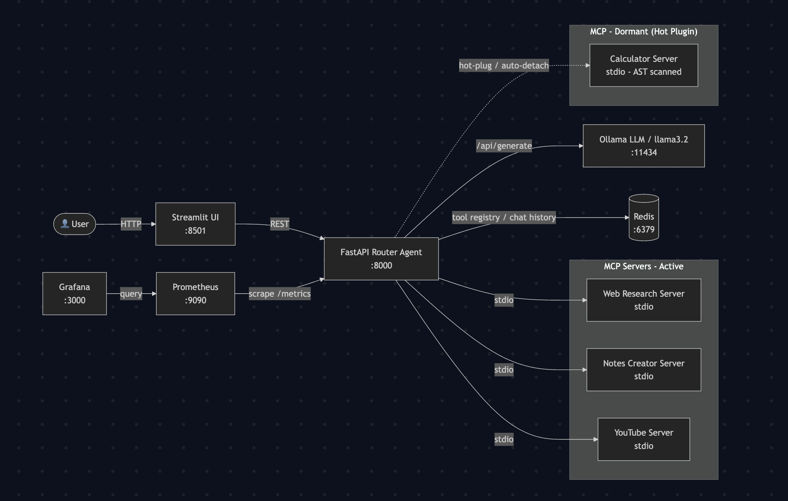
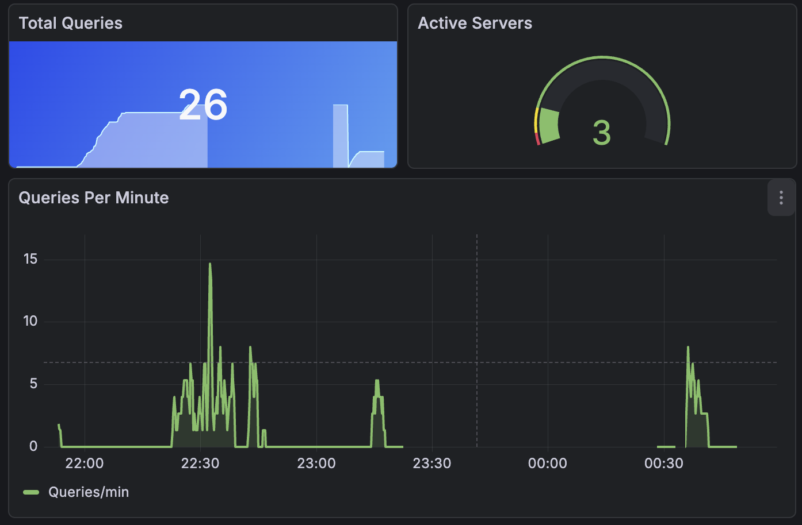
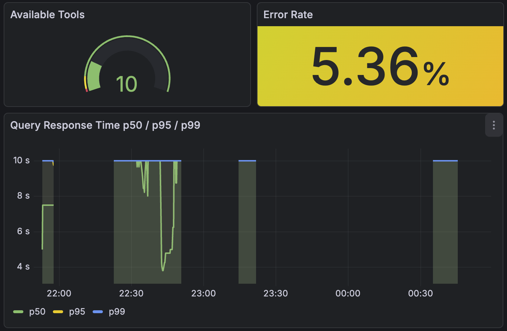
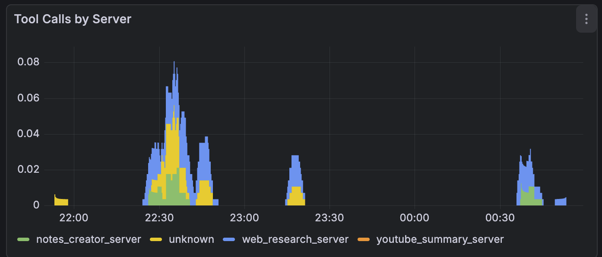
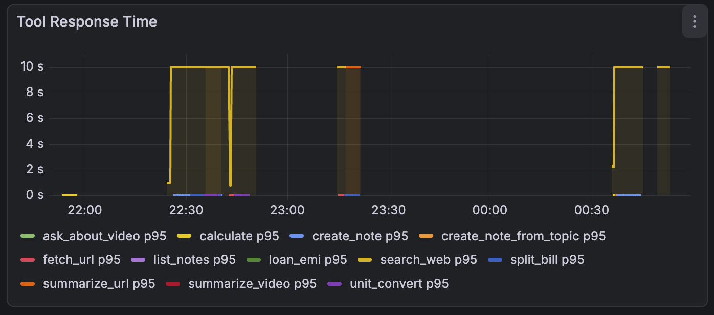
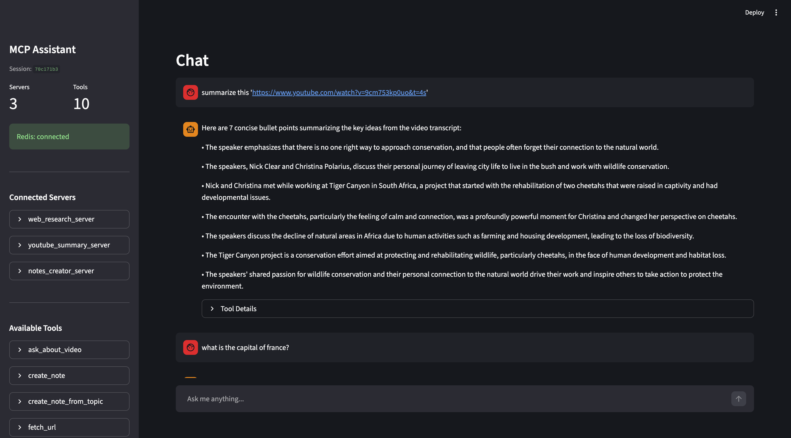
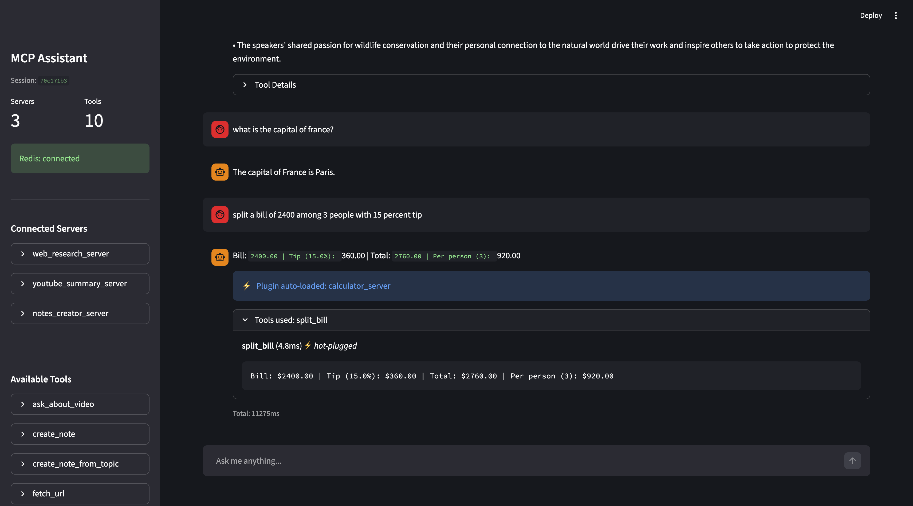

# MCP Hot-Swap Multi-Agent Assistant

### Hot-pluggable AI tools via Model Context Protocol

    

A production-grade AI agent platform with runtime tool hot-swapping, LLM-powered routing, and full-stack observability. New capabilities can be added by dropping a Python file — no agent restarts, no code changes, no redeployment.

> **100% local.** Runs entirely on your machine with Ollama. No API keys, no cloud costs.

---

## Key Features

- **Hot-Pluggable Tool Architecture** — Tool servers start dormant (AST-scanned, not running). They load on-demand, execute, and auto-detach after use — within a single query lifecycle.
- **Dynamic Tool Discovery** — The router agent discovers MCP servers at startup and scans dormant plugins statically. New tools appear instantly on registration via REST API.
- **LLM-Powered Routing** — Ollama (llama3.2) selects the right tool from natural language; supports parallel multi-tool dispatch via `asyncio.gather()`.
- **Auto Parameter Correction** — Positionally remaps LLM-generated wrong parameter names to schema-correct names when count matches — zero manual intervention.
- **Full Observability** — 6 Prometheus metrics with a pre-built Grafana dashboard covering P50/P95/P99 latency, tool call rates, and error rate.
- **Conversation Memory** — Per-session chat history persisted in Redis, isolated across sessions.
- **One-Command Deploy** — `bash scripts/start.sh` brings up all 7 services, fully wired.

---

## 🏗 Architecture



**How it works:**
1. User sends a natural language query via Streamlit UI
2. FastAPI Router Agent sends the query + available tools list to Ollama
3. LLM decides which tools to call (zero, one, or many)
4. Dormant servers are hot-plugged on demand — loaded, executed, then auto-detached
5. Tools execute in parallel via MCP stdio sessions
6. Results are synthesized into a single response

---

## Tech Stack

| Layer | Technology | Purpose |
|-------|------------|---------|
| LLM | Ollama + llama3.2 | Local inference, zero-cost tool routing |
| Agent | FastAPI + asyncio | Async router agent with parallel tool execution |
| Tool Protocol | MCP SDK (stdio transport) | Standardised tool discovery and execution |
| Hot-Swap Engine | AST scanner + stop-events | Dormant plug-in lifecycle management |
| Registry | Redis Hashes + Sorted Sets | Tool metadata, server mapping, script paths |
| Chat History | Redis Lists (capped, 50 msgs) | Per-session conversation persistence |
| UI | Streamlit | Chat interface + server management panel |
| Monitoring | Prometheus + Grafana | 6 instruments, P50/P95/P99 latency dashboards |
| Orchestration | Docker Compose | 7-service single-command deployment |

---

## MCP Tool Servers

| Server | Tools | Description |
|--------|-------|-------------|
| **Calculator** *(dormant — hot-plugged on demand)* | `calculate`, `percentage`, `split_bill`, `unit_convert`, `loan_emi` | Math, conversions, finance |
| **Web Research** | `search_web`, `fetch_url`, `summarize_url` | DuckDuckGo search, page scraping |
| **Notes Creator** | `create_note`, `create_note_from_topic`, `list_notes`, `read_note` | Markdown notes with YAML frontmatter |
| **YouTube** | `get_transcript`, `summarize_video`, `ask_about_video` | Transcript extraction, video Q&A |

**14 tools total across 4 servers.** Calculator stays dormant until needed — proving zero-downtime hot-swap.

---

## Quick Start

### Prerequisites

- Docker Desktop (4 GB+ RAM allocated)
- Ollama with llama3.2 pulled

```bash
ollama pull llama3.2
```

### Run

```bash
git clone https://github.com/Arj-01/mcp-hotswap-agent.git
cd mcp-hotswap-agent
bash scripts/start.sh
```

This starts all 7 services (API, frontend, Redis, Ollama, Prometheus, Grafana) and pulls the LLM model automatically.

| Service | URL |
|---------|-----|
| Chat UI | http://localhost:8501 |
| Agent API | http://localhost:8000/docs |
| Grafana | http://localhost:3000 (admin / admin) |
| Prometheus | http://localhost:9090 |

### Local Development

```bash
# Install dependencies
pip install -e ".[dev]"

# Start Redis and Ollama
redis-server &
ollama serve &

# Start the API
uvicorn agents.main:app --reload --port 8000

# Start the frontend (separate terminal)
streamlit run frontend/app.py
```

---

## Hot-Swap Demo

See the core value proposition in action — calculator server is dormant at startup, then hot-plugged mid-session:

**Zero code changes. Zero restarts.**

```bash
bash scripts/load_test.sh
```

```
Servers at startup:
  - youtube_summary_server  (3 tools, active)
  - notes_creator_server    (4 tools, active)
  - web_research_server     (3 tools, active)

Dormant: calculator (calculate, percentage, split_bill, unit_convert, loan_emi)

Query 1: "search for latest AI news"     → search_web       hot-plug: NO
Query 2: "say hello in French"           → none (LLM)       hot-plug: NO
Query 4: "calculate 42 * 58"             → calculate        hot-plug: YES ⚡ calculator_server
Query 5: "search for python tutorials"   → search_web       hot-plug: NO  (calculator detached)
Query 8: "calculate 15% of 8500"         → calculate        hot-plug: YES ⚡ fresh plug again
Query 11: "split bill of 2400 for 3"     → split_bill       hot-plug: YES ⚡ third cycle

ALL TESTS PASSED ✓  (12/12)
Hot-plug cycles: attached 3× · detached 3× · perfect symmetry
```

---

## API Endpoints

| Method | Endpoint | Description |
|--------|----------|-------------|
| `POST` | `/query` | Send a query to the router agent |
| `GET` | `/tools` | List all registered tools |
| `GET` | `/servers` | List connected MCP servers |
| `POST` | `/servers/register` | Register a new MCP server |
| `DELETE` | `/servers/{name}` | Disconnect a server |
| `GET` | `/chat/history/{session_id}` | Get conversation history |
| `DELETE` | `/chat/history/{session_id}` | Clear session history |
| `GET` | `/health` | Health check (servers, tools, Redis) |
| `GET` | `/metrics` | Prometheus metrics |

---

## Monitoring

The auto-provisioned **MCP Assistant** Grafana dashboard includes:

| Panel | Metric |
|-------|--------|
| Total Queries | `sum(queries_total)` |
| Active Servers | `active_servers_count` |
| Available Tools | `available_tools_count` |
| Error Rate | `queries_total{status="error"}` / total × 100 |
| Queries Per Minute | `rate(queries_total[1m]) * 60` |
| Response Time P50/P95/P99 | `histogram_quantile` over `query_duration_seconds_bucket` |
| Tool Calls by Server | `rate(tool_calls_total[5m])` by server |
| Tool Response Time | `histogram_quantile(0.95, ...)` by tool |

Access at **http://localhost:3000** (admin / admin)

### Grafana Screenshots






---

## Chat UI




---

## Adding a Custom Tool Server

Drop a Python file in `servers/`:

```python
# servers/my_tools_server.py
from mcp.server.fastmcp import FastMCP

mcp = FastMCP("my-tools")

@mcp.tool()
def greet(name: str) -> str:
    """Say hello to someone."""
    return f"Hello, {name}!"

if __name__ == "__main__":
    mcp.run(transport="stdio")
```

Register it via the API — no restart required:

```bash
curl -X POST http://localhost:8000/servers/register \
  -H "Content-Type: application/json" \
  -d '{"name": "my-tools", "script_path": "servers/my_tools_server.py"}'
```

The agent immediately starts routing queries to your new tools.

---

## Project Structure

```
mcp-hotswap-agent/
├── agents/
│   ├── main.py              # FastAPI app with all endpoints
│   ├── router_agent.py      # LLM-powered tool routing + hot-swap logic
│   ├── mcp_client.py        # MCP stdio session manager + AST plugin scanner
│   ├── tool_registry.py     # Redis-backed tool storage (Hash + Sorted Set)
│   ├── chat_history.py      # Session-isolated conversation persistence
│   ├── config.py            # Settings (env vars)
│   └── metrics.py           # Prometheus counters / histograms / gauges
├── servers/
│   ├── calculator_server.py      # Math, finance, unit conversion (dormant)
│   ├── web_research_server.py    # DuckDuckGo search, URL fetch
│   ├── notes_creator_server.py   # Markdown notes with YAML frontmatter
│   └── youtube_summary_server.py # Transcript extraction, video Q&A
├── frontend/
│   └── app.py               # Streamlit chat UI + server management
├── docker/
│   ├── Dockerfile
│   ├── Dockerfile.frontend
│   └── docker-compose.yml   # 7-service orchestration
├── monitoring/
│   ├── prometheus.yml
│   ├── grafana-dashboard.json
│   ├── grafana-datasource.yml
│   └── grafana-dashboard-provider.yml
├── scripts/
│   ├── start.sh             # One-command Docker startup
│   ├── load_test.sh         # 12-query hot-swap verification test
│   └── e2e_smoke.sh         # E2E smoke test against live stack
├── screenshots/
│   ├── architecture.png
│   └── grafana-metrics/
│       ├── metrics_1.png
│       ├── metrics_2.png
│       ├── metrics_3.png
│       └── metrics_4.png
├── tests/
│   ├── test_hotswap.py          # Hot-plug lifecycle: attach → execute → detach → rescan
│   ├── test_integration.py      # Full API flows (ASGI client + fakeredis)
│   ├── test_error_scenarios.py  # Ollama offline, timeout, garbage JSON, tool errors
│   ├── test_param_correction.py # LLM param name correction edge cases
│   ├── test_chat_history.py     # Session-isolated Redis chat history
│   └── test_tool_registry.py    # Redis registry CRUD
└── pyproject.toml
```

---

## Testing

```bash
# Run all 40+ tests
pytest tests/ -v

# Run specific modules
pytest tests/test_hotswap.py -v
pytest tests/test_integration.py -v
pytest tests/test_error_scenarios.py -v

# E2E smoke test (requires docker compose up)
bash scripts/e2e_smoke.sh

# Hot-swap load test (12 queries, 3 hot-plug cycles)
bash scripts/load_test.sh
```

---

## Key Features (Detailed)

- **Hot-Swap Lifecycle** — Dormant scan → hot-plug → execute → auto-detach → re-scan, verified with perfect attach/detach symmetry across 3 independent cycles.
- **Async Session Manager** — Background `asyncio.Task` per server with stop-event signals for clean lifecycle; single-retry on connection failure; auto-reconnect on session loss.
- **Parallel Tool Execution** — Multi-tool queries dispatch concurrently via `asyncio.gather()` with per-tool latency tracking.
- **Param Auto-Correction** — Positional remapping of LLM key-name mismatches when param count matches schema — tested across 4 edge cases.
- **5 Fault Modes Tested** — Ollama offline, ReadTimeout, garbage JSON (retry + fallback), tool exception propagation, synthesis failure fallback to concatenation.
- **Redis Data Model** — `tools:{name}` Hash, `server_tools:{name}` Set, `tool_index` Sorted Set, `chat:{session_id}` capped List — all ops via async pipeline for atomicity.